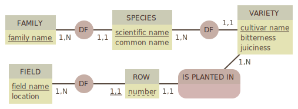

# SQL advanced JOIN requests

Just practicing SQL.

## MCD

**[Mocodo](http://mocodo.wingi.net/)** MCD:

```sql
FAMILY: family name
DF1, 1N FAMILY, 11 SPECIES
SPECIES: scientific name, common name
DF2, 1N SPECIES, 11 VARIETY
VARIETY: cultivar name, bitterness, juiciness

FIELD: field name, location
DF3, 1N FIELD, _11 ROW
ROW: number
IS PLANTED IN, 11 ROW, 1N VARIETY
```




## Joined requests

### Species common and scientific name, whith family

```sql
SELECT species.id AS specy_id, species.scientific_name AS specy_scientific_name, species AS specy_common_name, family.name AS family
FROM species
JOIN family ON species.family_id=family.id;
```

### Species with at least one variety which has bitter = 5

```sql
SELECT species.id AS specy_id, species.scientific_name AS specy_scientific_name, species AS specy_common_name, family.name AS family
FROM species
JOIN family ON species.family_id=family.id
JOIN variety ON species.id=variety.species_id
WHERE variety.bitterness=5;
```

Without doublon

```sql
SELECT DISTINCT species.id AS specy_id, species.scientific_name AS specy_scientific_name, species AS specy_common_name, family.name AS family
FROM species
JOIN family ON species.family_id=family.id
JOIN variety ON species.id=variety.species_id
WHERE variety.bitterness=5;
```

We can also write

```sql
SELECT DISTINCT ON (species.id) species.id, species.scientific_name AS specy_scientific_name, species AS specy_common_name, family.name AS family
FROM species
JOIN family ON species.family_id=family.id
JOIN variety ON species.id=variety.species_id
WHERE variety.bitterness=5;
```

**Other solution**

```sql
SELECT species.id, scientific_name, common_name
FROM variety
INNER JOIN species ON species.id=variety.species_id AND variety.bitterness = 5;
```

Without doublon

```sql
SELECT DISTINCT species.id, scientific_name, common_name
FROM variety
INNER JOIN species ON species.id=variety.species_id AND variety.bitterness = 5;
```

## Where are the vinegar variety rows?

```sql
SELECT field.name AS field, row.label AS row, variety.cultivar
FROM variety
JOIN row ON variety.id=row.variety_id
JOIN field ON field.id=row.field_id
WHERE bitterness=5;
```

With better view, thanks to array_agg

```sql
SELECT field.name AS field, array_agg(row.label) AS rows
FROM variety
JOIN row ON variety.id=row.variety_id
JOIN field ON field.id=row.field_id
WHERE bitterness=5
GROUP BY field.name;
```

With common name

```sql
SELECT field.name, 
	ARRAY_AGG (species.common_name || ' ' || row.label) infos
FROM variety
INNER JOIN species ON species.id=variety.species_id AND variety.bitterness = 5
INNER JOIN row ON row.variety_id=variety.id
INNER JOIN field ON field.id=row.field_id
GROUP BY field.name
ORDER BY field.name;
```

And with cultivars in the array

```sql
SELECT field.name AS field, array_agg(row.label ORDER BY row.label::integer) AS rows, array_agg(DISTINCT variety.cultivar) as cultivars
FROM variety
JOIN row ON variety.id=row.variety_id
JOIN field ON field.id=row.field_id
WHERE bitterness=5
GROUP BY field.name;
```

With row label order by ascendant :
We cast the value of the order by in `integer`, but only in the `ORDER BY`, because we do **not** want to modify the original data

```sql
SELECT field.name AS field, array_agg(row.label ORDER BY row.label::integer) AS rows, array_agg(DISTINCT variety.cultivar) as cultivars
FROM variety
JOIN row ON variety.id=row.variety_id
JOIN field ON field.id=row.field_id
WHERE bitterness=5
GROUP BY field.name;
```

## nested requests

### Family which has any specy with average juiciness superior to 2.5

**1**

```sql
SELECT species_id, ROUND(AVG(juiciness), 2)
FROM variety
GROUP BY species_id;
```

**1.1**

```sql
SELECT species_id, ROUND(AVG(juiciness), 2) AS juiciness
FROM variety
GROUP BY species_id
HAVING AVG(juiciness) > 2.5;
```

**1.2**

```sql
SELECT species_id
FROM variety
GROUP BY species_id
HAVING AVG(juiciness) > 2.5;
```

**2.1**

```sql
SELECT * FROM species
WHERE id IN (
	SELECT species_id
  FROM variety
  GROUP BY species_id
  HAVING AVG(juiciness) > 2.5
);
```

or

```sql
SELECT * FROM species
WHERE id = ANY (
	SELECT species_id
  FROM variety
  GROUP BY species_id
  HAVING AVG(juiciness) > 2.5
);
```

**2.2**

```sql
SELECT family_id FROM species
WHERE id IN (
	SELECT species_id
  FROM variety
  GROUP BY species_id
  HAVING AVG(juiciness) > 2.5
);
```

**3**

```sql
SELECT name
FROM family
WHERE id NOT IN (
	SELECT family_id FROM species
	WHERE id IN (
		SELECT species_id
  		FROM variety
  		GROUP BY species_id
  		HAVING AVG(juiciness) > 2.5
	)
);
```

or
Without `NOT IN`, which is *don't do this* by postgres.  
we use `id <> ALL` : id has to be different of all values (valu1 and value2 and vamue3...).  
(if we use `id <> IN` : id has to be different of value1 or value2 or value3...)

```sql
SELECT name
FROM family
WHERE id <> ALL (
	SELECT family_id FROM species
	WHERE id = ANY (
		SELECT species_id
  		FROM variety
  		GROUP BY species_id
  		HAVING AVG(juiciness) > 2.5
	)
);
```

### Fields which has mandarine (even just one row)

**1**

```sql
SELECT id FROM species
WHERE family_id=(
	SELECT id FROM family
	WHERE name='mandarine'
);
```

**2**

```sql
SELECT id FROM variety
WHERE species_id = ANY(
	SELECT id FROM species
	WHERE family_id=(
		SELECT id FROM family
		WHERE name='mandarine'
	)
);
```

**3**

```sql
SELECT field_id FROM row
WHERE variety_id=ANY(
	SELECT id FROM variety
	WHERE species_id = ANY(
		SELECT id FROM species
		WHERE family_id=(
			SELECT id FROM family
			WHERE name='mandarine'
		)
	)
);
```

**4**

```sql
SELECT name FROM field
WHERE id = ANY(
	SELECT field_id FROM row
	WHERE variety_id = ANY(
		SELECT id FROM variety
		WHERE species_id = ANY(
			SELECT id FROM species
			WHERE family_id=(
				SELECT id FROM family
				WHERE name='mandarine'
			)
		)
	)
);
```

#### For better readinf comfort, we can create temporary table and write:

**1**

```sql
WITH mandarine_family AS (
	SELECT id FROM family WHERE name='mandarine'
),
mandarine_species AS (
	SELECT species.id FROM species
	JOIN mandarine_family ON species.family_id=mandarine_family.id
)
SELECT * FROM mandarine_species;
```

**2**

```sql
WITH mandarine_family AS (
    SELECT id FROM family WHERE name='mandarine'
),
mandarine_species AS (
    SELECT species.id FROM species
    JOIN mandarine_family ON species.family_id=mandarine_family.id
),
mandarine_cultivar AS (
    SELECT variety.id FROM variety
    JOIN mandarine_species ON mandarine_species.id=variety.species_id
),
mandarine_rows AS (
    SELECT DISTINCT field_id FROM row
    JOIN mandarine_cultivar ON mandarine_cultivar.id=row.variety_id
)

SELECT field.* FROM field
JOIN mandarine_rows ON mandarine_rows.field_id=field.id;
```

## TIPS

On peut faire la manip inverse du array_agg

```sql
SELECT UNNEST(ARRAY['1', '2', '3']);
```

On peut voir le type d'une valeur

```sql
SELECT pg_typeof(null);
```